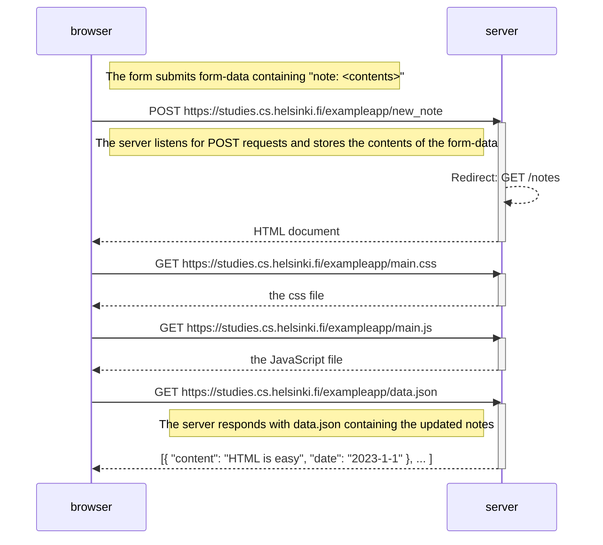

```mermaid
sequenceDiagram
    participant browser
    participant server

	Note right of browser: The form submits form-data containing "note: <contents>"
    browser->>server: POST https://studies.cs.helsinki.fi/exampleapp/new_note
    activate server
	Note left of server: The server listens for POST requests and stores the contents of the form-data
	server-->>server: Redirect: GET /notes

    server-->>browser: HTML document
    deactivate server

    browser->>server: GET https://studies.cs.helsinki.fi/exampleapp/main.css
    activate server
    server-->>browser: the css file
    deactivate server

    browser->>server: GET https://studies.cs.helsinki.fi/exampleapp/main.js
    activate server
    server-->>browser: the JavaScript file
    deactivate server

    browser->>server: GET https://studies.cs.helsinki.fi/exampleapp/data.json
    activate server
    Note left of server: The server responds with data.json containing the updated notes
    server-->>browser: [{ "content": "HTML is easy", "date": "2023-1-1" }, ... ]
    deactivate server

```
