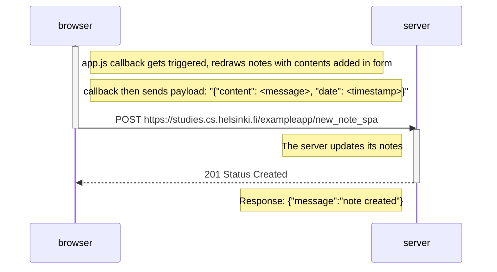

```mermaid
sequenceDiagram
    participant browser
    participant server

	activate browser
	Note right of browser: app.js callback gets triggered, redraws notes with contents added in form
	Note right of browser: callback then sends payload: "{"content": <message>, "date": <timestamp>}"
    browser->>server: POST https://studies.cs.helsinki.fi/exampleapp/new_note_spa
	deactivate browser
    activate server
	Note left of server: The server updates its notes

    server-->>browser: 201 Status Created
    deactivate server
	Note left of server: Response: {"message":"note created"}


```
