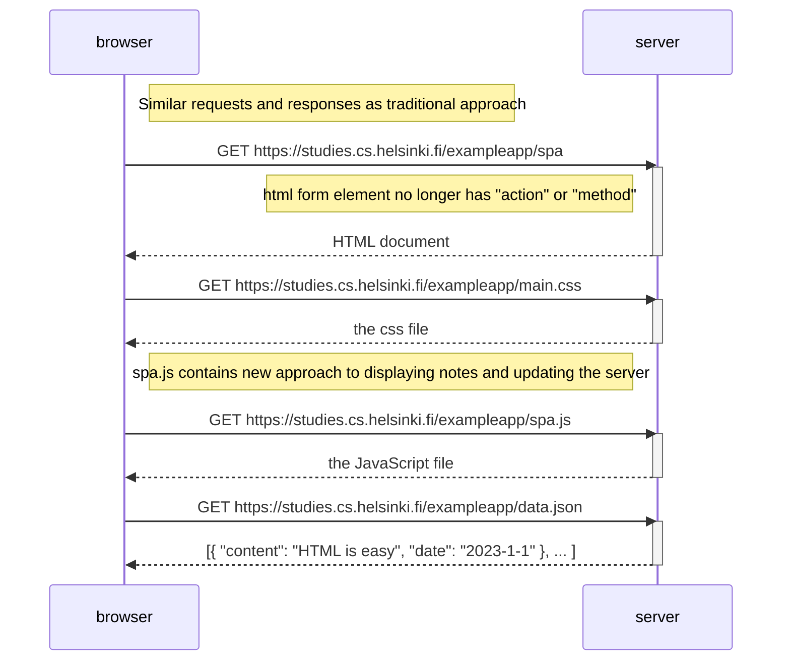

```mermaid
sequenceDiagram
    participant browser
    participant server

	Note right of browser: Similar requests and responses as traditional approach

    browser->>server: GET https://studies.cs.helsinki.fi/exampleapp/spa
    activate server
	Note left of server: html form element no longer has "action" or "method"
    server-->>browser: HTML document
    deactivate server

    browser->>server: GET https://studies.cs.helsinki.fi/exampleapp/main.css
    activate server
    server-->>browser: the css file
    deactivate server

	Note left of server: spa.js contains new approach to displaying notes and updating the server
    browser->>server: GET https://studies.cs.helsinki.fi/exampleapp/spa.js
    activate server
    server-->>browser: the JavaScript file
    deactivate server

    browser->>server: GET https://studies.cs.helsinki.fi/exampleapp/data.json
    activate server
    server-->>browser: [{ "content": "HTML is easy", "date": "2023-1-1" }, ... ]
    deactivate server

```
